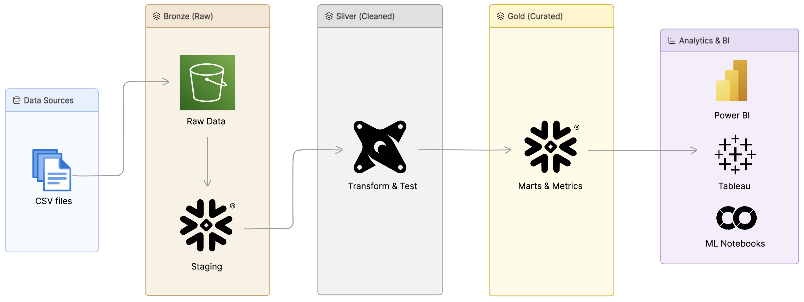
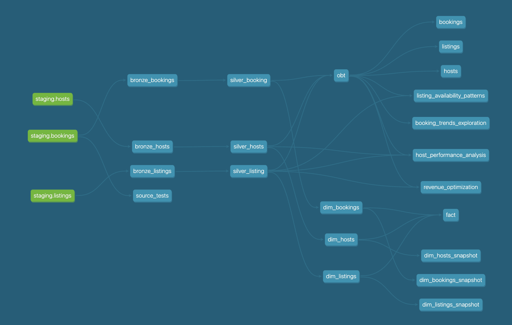

# UrbanNest Analytics Engineering — dbt + Snowflake Medallion Warehouse


## Overview

This project implements a comprehensive data warehouse for UrbanNest data using dbt (Data Build Tool) on Snowflake. It follows a medallion architecture (Bronze, Silver, Gold layers) to transform raw UrbanNest data from AWS S3 into analytical-ready datasets. The project includes data modeling, testing, documentation, and analytics capabilities.

## Architecture

Raw data is staged from AWS S3 into Snowflake's staging schema before Bronze layer ingestion.
The project follows a **Medallion Architecture** with a **Star Schema** in the Gold layer:

- **Bronze Layer**: Raw data ingestion from source systems
- **Silver Layer**: Cleaned and transformed data with business logic
- **Gold Layer**: Dimensional modeling with Star Schema (Fact + Dimensions)

### Star Schema Design
- **Fact Table**: `fact` - Central table containing booking measures and foreign keys
- **Dimension Tables**: `dim_listings`, `dim_hosts`, `dim_bookings` - Descriptive attributes
- **OBT (One Big Table)**: Denormalized analytics table for complex queries, built from silver models using `ref()` so dbt DAG dependencies resolve correctly

### Architecture



## Key dbt Concepts Used

### 1. **Sources**
Sources define the raw data tables from external systems. This project uses Snowflake as the data warehouse.

```yaml
sources:
  - name: staging
    database: urbannest
    schema: staging
    tables:
      - name: bookings
      - name: listings
      - name: hosts
```

### 2. **Models**
Models are SQL transformations that build tables/views in the warehouse.

- **Materializations**: Table, View, Incremental, Ephemeral
- **Custom Schemas**: Organized by layer (bronze, silver, gold)

### 3. **Incremental Models**
Bronze layer models use incremental materialization for efficient data loading.

```sql
{{ config(materialized='incremental') }}

select *
from {{ source('staging', 'bookings') }}


    where created_at > (select coalesce(max(created_at), '1900-01-01') from {{ this }})

```

### 4. **Macros**
Reusable SQL snippets for common transformations.

Example: Multiply macro for calculations
```sql

    round({{ x }} * {{ y }}, {{ precision }})

```

### 5. **Tests**
Data quality tests ensure data integrity.

- **Generic Tests**: unique, not_null, accepted_values
- **Custom Tests**: Business logic validations

### 6. **Snapshots**
Slowly Changing Dimensions (SCD) for historical tracking.

```yaml
snapshots:
  - name: dim_bookings_snapshot
    relation: ref('dim_bookings')
    config:
      strategy: timestamp
      updated_at: booking_date
      unique_key: booking_id
```

### 7. **Analyses**
Ad-hoc queries for data exploration and analysis.

### 8. **Seeds**
Static data files loaded into the warehouse.

### 9. **Hooks**
Pre/post hooks for setup and cleanup operations.

### 10. **Documentation**
Auto-generated documentation with dbt docs.

## Project Structure

```
dbt_snowflake_aws/
├── dbt_project.yml          # Project configuration
├── models/
│   ├── sources/
│   │   └── sources.yml      # Source definitions
│   ├── properties.yml       # Model properties & comprehensive test suite
│   ├── bronze/              # Raw data layer
│   │   ├── bronze_bookings.sql
│   │   ├── bronze_hosts.sql
│   │   └── bronze_listings.sql
│   ├── silver/              # Cleaned data layer
│   │   ├── silver_booking.sql
│   │   ├── silver_hosts.sql
│   │   └── silver_listing.sql
│   └── gold/                # Analytics layer
│       ├── fact.sql         # Fact table (star schema center)
│       ├── obt.sql          # One Big Table (denormalized)
│       ├── dim_listings.sql # Listings dimension
│       ├── dim_hosts.sql    # Hosts dimension
│       ├── dim_bookings.sql # Bookings dimension
│       └── ephemeral/       # Ephemeral models
├── macros/                  # Reusable SQL functions
│   ├── generate_schema_name.sql
│   ├── multiply.sql
│   ├── tag.sql
├── analyses/                # Exploratory queries
│   ├── booking_trends_exploration.sql    # Monthly trends, seasonality analysis
│   ├── host_performance_analysis.sql     # Host metrics and comparisons
│   ├── listing_availability_patterns.sql # Utilization and pricing insights
│   └── revenue_optimization.sql          # Revenue forecasting and optimization
├── snapshots/               # SCD snapshots
│   ├── dim_bookings_snapshot.yml
│   ├── dim_hosts_snapshot.yml
│   └── dim_listings_snapshot.yml
├── tests/                   # Data quality tests
│   └── source_tests.sql
├── seeds/                   # Static data
├── target/                  # Compiled artifacts
└── logs/                    # Execution logs
```

## Data Flow

1. **Ingestion**: Raw data from UrbanNest staging tables (bookings, listings, hosts)
2. **Bronze**: Incremental loading with basic transformations
3. **Silver**: Data cleaning, type casting, business logic application
4. **Gold Dimensions**: Create dim_listings, dim_hosts, dim_bookings from silver layer
5. **Gold Fact**: Build fact table joining dimensions in star schema
6. **Gold OBT**: Create denormalized analytics table from silver layer using `ref()`- based joins
7. **Snapshots**: SCD Type 2 on dimension tables for historical tracking

## Installation

### Prerequisites
- Python 3.8+
- dbt-core
- dbt-snowflake
- Snowflake account with appropriate permissions

## Usage

### Development Workflow

1. **Run models**
   ```bash
   dbt run
   ```

2. **Run tests**
   ```bash
   dbt test
   ```

3. **Generate documentation**
   ```bash
   dbt docs generate
   ```

4. **Serve documentation**
   ```bash
   dbt docs serve
   ```

### Selective Execution

```bash
# Run specific model
dbt run --select bronze_bookings

# Run by tag
dbt run --select tag:bronze

# Run tests for specific model
dbt test --select fact
```

### DAG Visualization



## Key Models

### Bronze Layer
- `bronze_bookings`: Raw booking data with incremental loading
- `bronze_listings`: Raw listing information
- `bronze_hosts`: Raw host data

### Silver Layer
- `silver_booking`: Cleaned booking data with calculated fields
- `silver_hosts`: Standardized host information
- `silver_listing`: Processed listing data

### Gold Layer - Star Schema
- **`fact`**: Central fact table with booking measures and foreign keys to dimensions
- **`dim_listings`**: Listing dimension with property details and categories
- **`dim_hosts`**: Host dimension with performance metrics and experience levels
- **`dim_bookings`**: Booking dimension with status and temporal attributes
- **`obt`**: One Big Table - denormalized view for complex analytics queries

### Snapshots (SCD Type 2)
- `dim_bookings_snapshot`: Historical tracking of booking changes
- `dim_hosts_snapshot`: Historical tracking of host changes
- `dim_listings_snapshot`: Historical tracking of listing changes

## Macros & Utilities

- `multiply()`: Safe multiplication with rounding
- `generate_schema_name()`: Dynamic schema generation
- `tag()`: Metadata tagging

## Testing Strategy

The project implements comprehensive data quality testing across all layers using dbt's built-in testing framework and custom tests defined in `models/properties.yml`.

### **Test Types by Layer**

#### **Bronze Layer Tests** (Raw Data Quality)
- **Primary Key Validation**: `not_null` + `unique` for booking_id, listing_id, host_id
- **Required Fields**: All critical columns validated for null values
- **Data Completeness**: Ensures staging data meets minimum quality standards

#### **Silver Layer Tests** (Business Logic Validation)
- **All Bronze tests** plus:
- **Relationship Integrity**: Foreign key relationships between tables
- **Accepted Values**: Enum validation for status fields (booking_status, response_rate, is_superhost)
- **Data Type Consistency**: Validates transformed data maintains expected formats

#### **Gold Layer Tests** (Analytics Validation)
- **Primary Key Integrity**: Ensures fact and dimension tables maintain uniqueness
- **Referential Integrity**: Validates relationships in star schema
- **Business Metric Validation**: Ensures calculated fields are accurate

### **Specific Test Examples**

```yaml
# Bronze Layer - Basic data quality
- name: booking_id
  tests:
    - not_null
    - unique

# Silver Layer - Advanced validation
- name: listing_id
  tests:
    - not_null
    - relationships:
        to: ref('silver_listing')
        field: listing_id

# Silver Layer - Enum validation
- name: booking_status
  tests:
    - accepted_values:
        values: ['confirmed', 'cancelled', 'pending', 'completed']
```

### **Running Tests**

```bash
# Run all tests
dbt test

# Run tests by layer
dbt test --select bronze
dbt test --select silver
dbt test --select gold

# Run tests for specific model
dbt test --select silver_booking

# Run only relationship tests
dbt test --select test_type:relationships
```

## Snapshots (SCD Type 2)

Maintains historical versions of dimension data through snapshot resources:
- `dim_bookings_snapshot`: Booking dimension history
- `dim_hosts_snapshot`: Host information history
- `dim_listings_snapshot`: Listing details history

## Analytics & Reporting

### Analyses Included
- **Booking Trends Exploration** (`analyses/booking_trends_exploration.sql`): Monthly booking patterns, seasonal trends, weekend vs weekday analysis
- **Host Performance Analysis** (`analyses/host_performance_analysis.sql`): Top hosts by revenue, response rate impact, superhost vs regular host comparison
- **Listing Availability Patterns** (`analyses/listing_availability_patterns.sql`): Utilization rates, price elasticity, seasonal patterns, room configuration impact
- **Revenue Optimization Insights** (`analyses/revenue_optimization.sql`): Pricing optimization, customer segmentation, cancellation analysis, forecasting

### Running Analyses

```bash
# Run all analyses
dbt run --select analyses

# Run specific analysis
dbt run --select analyses/booking_trends_exploration.sql

# Compile analysis without running
dbt compile --select analyses/revenue_optimization.sql
```

## Performance Optimization

- **Incremental Models**: Efficient data loading
- **Ephemeral Models**: Memory-based transformations
- **Materialization Strategies**: Table vs View based on usage
- **Partitioning**: Optimized for query performance

## Monitoring & Logging

- **dbt Logs**: Execution logs in `logs/` directory
- **Run Results**: JSON artifacts in `target/`
- **Data Quality**: Automated test results
- **Documentation**: Auto-generated model docs

## Troubleshooting

### Common Issues

1. **Connection Errors**: Verify Snowflake credentials
2. **Test Failures**: Check data quality in source tables
3. **Incremental Load Issues**: Validate timestamp columns
4. **Macro Errors**: Test macro logic independently

### Debug Commands

```bash
# Check model compilation
dbt compile --select model_name

# Debug specific test
dbt test --select test_name --debug

# View model dependencies
dbt ls --select model_name --resource-type model
```
---
